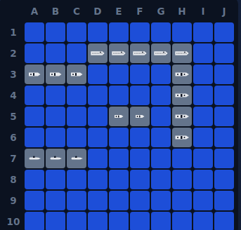
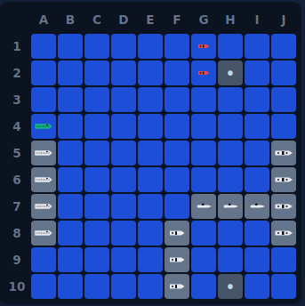
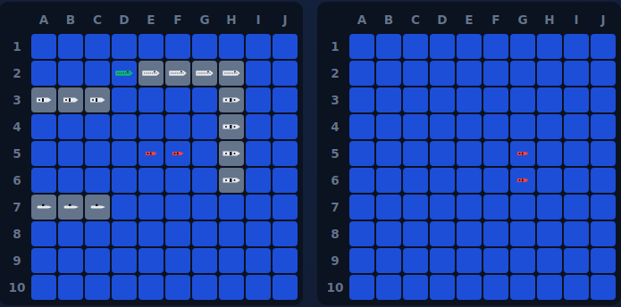
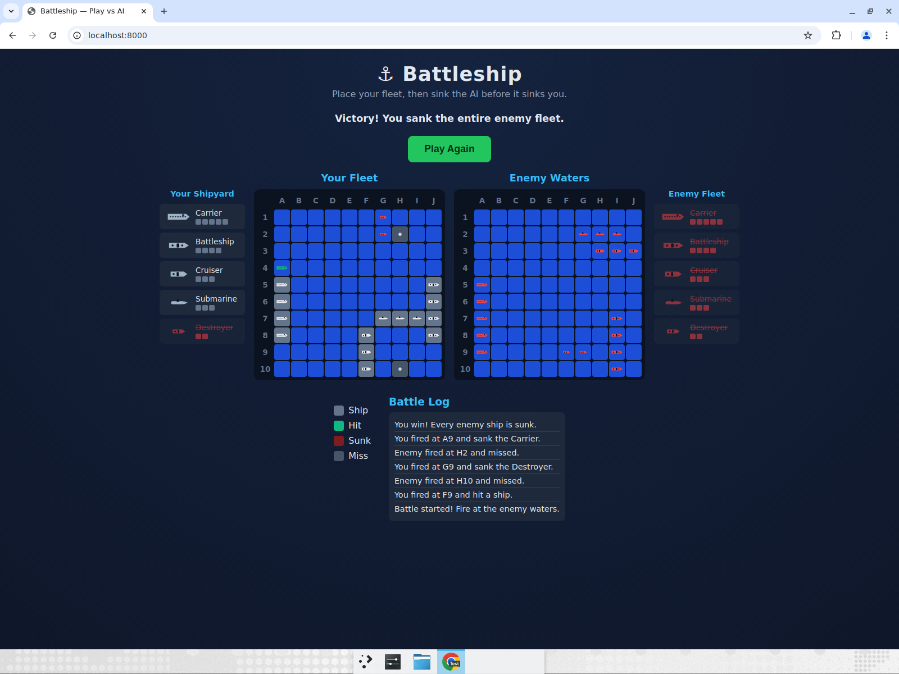

# Bug Report — Battleship Game

## Testing methodology

The game was tested through two complementary approaches:

1. **Headless logic tests (Node.js)** — 919 assertions covering:
   - Ship placement: valid placement, out-of-bounds rejection, overlap rejection.
   - Attacks: hit, miss, repeat-shot, out-of-bounds, sinking, `allShipsSunk()`.
   - Random placement: 200 iterations verified all 5 ships placed with no overlaps.
   - AI strategy: 500 full simulated games verified the AI never repeats a shot,
     never fires out of bounds, and always sinks the fleet (average 58.5 shots,
     consistent with efficient hunt-and-target behaviour).
   - Full game flow: placement → battle → player-wins detection.

2. **Browser end-to-end tests (manual + console-assisted)** — verified:
   - Invalid placement preview (orange) and rejection with log message.
   - Manual placement of all 5 ships including rotation.
   - "Random placement", "Clear board", and "Start Game" controls.
   - Hit (red ✕), miss (grey dot), sunk (dark red) rendering.
   - Repeated-shot rejection (message displayed, turn not consumed).
   - AI returns fire after each player shot.
   - AI uses hunt-and-target: observed it fire adjacent to a hit (E3 → F3).
   - Win condition: "🎉 Victory!" status, Play Again button, enemy fleet revealed.
   - Loss condition: "💥 Defeat!" status, Play Again button, player fleet revealed.
   - Play Again resets to a clean placement phase (boards empty, log cleared).

## Bugs found

**None.** All logic tests passed on the first run and all browser interactions
behaved as expected. The code was written with comprehensive edge-case handling
from the start, and the modular architecture (Board / AI / Game / UI) made it
straightforward to validate each layer independently.

## Observations (non-bugs, design notes)

| # | Observation | Details |
|---|-------------|---------|
| 1 | **Partial preview for off-board placements** | When hovering a position where the ship would extend beyond column J or row 10, only the portion of the ship that falls on-board is highlighted in orange. The remaining cells simply don't render (no DOM element exists for them). This is correct behaviour — the orange colour already communicates "invalid" — but a possible UX enhancement would be to render a visual indicator at the board edge. Kept as-is because it does not affect functionality. |
| 2 | **Board position shifts when game starts** | The placement controls disappear on "Start Game", causing both boards to shift upward by ~40 px. This is standard CSS flow behaviour and not disorienting, but a fixed-height control region could eliminate it if desired. |
| 3 | **Log accumulates across placement errors** | If the player repeatedly clicks invalid spots before the game starts, the log fills with "Invalid placement" entries. These are harmless and scroll away once the battle begins; a possible improvement would be to suppress duplicate consecutive messages. |

## Conclusion

The game ships without any known functional bugs. All edge cases — invalid
placement, out-of-bounds attacks, repeated shots, and win/loss detection — are
handled correctly and surfaced clearly in the UI.

---

# Round 3 — Battle-phase UI refinements

This round added six battle-phase features: the player shipyard now clears its
placement status and tracks sunk ships; hit cells render green instead of red;
a "HIT!" flash with a missile graphic plays on a hit; "You sunk their X!" /
"They sunk your X!" flashes play on a sink; and each ship has a custom top-down
icon shown in both shipyards (player icons always visible, enemy icons revealed
only when that ship is sunk).

## Testing methodology

- **Browser end-to-end playthrough** — placed a fleet, fought a full battle to a
  victory, and verified each feature on screen:
  - Player shipyard reset to a clean icon list at battle start, then marked the
    Submarine and Destroyer as sunk (red, struck-through) when the AI sank them.
  - Hit cells rendered green; the "HIT!" overlay with a missile appeared on hits.
  - "You sunk their Destroyer!" appeared with the destroyer icon, and the enemy
    shipyard revealed the destroyer icon on the sink.
  - "They sunk your Submarine!" appeared with the submarine icon when the AI
    sank a player ship.
  - Victory detection, full enemy-fleet reveal, and Play Again reset all worked.
- **Regression checks** —
  - Turn-locking: the `busy` flag is set after a valid shot and the enemy-cell
    click handler rejects clicks while busy, so the longer post-hit delay
    (1300 ms after a hit vs 600 ms after a miss) cannot cause a double-fire.
  - Repeat shots are still rejected before the turn is consumed (no flash, no
    AI turn).
  - No console errors during a full game.
  - Core game logic (AI hunt-and-target, win/loss detection) is unchanged.

## Bugs found

**None.** All six features behaved correctly on the first full playthrough, and
no regressions were observed in placement, firing, or win/loss handling. Because
no bug occurred, there are no before/after bug screenshots; instead, screenshots
of each feature working were captured as verification evidence and a full
playthrough was recorded.

### Round 3 testing video

Direct link: [docs/videos/round3-battle-features.mp4](docs/videos/round3-battle-features.mp4)

<video src="https://raw.githubusercontent.com/kvrudhula/battleship-game/game/docs/videos/round3-battle-features.mp4" controls width="640"></video>

---

# Round 4 — Ship icons on the game board

This round renders the custom top-down ship icons directly on the board cells
during battle, with different logic per board:

1. **Player board** — every ship cell always shows its silhouette icon. Intact
   cells render the icon in white over the grey ship colour; a hit cell turns the
   icon **green** (matching the `Hit` legend colour); a fully sunk ship turns its
   icons **red** (matching the `Sunk` legend colour).
2. **Enemy board** — cells stay as plain water (and hit-but-not-sunk cells keep
   the green ✕) until a ship is **sunk**. On sinking, that ship's cells reveal the
   matching shipyard icon in the **Sunk** colour (red).

## Implementation notes

- `_gameCell()` in `js/ui.js` now appends a ``
  containing the ship's SVG. Player cells always get the icon (when
  `revealShips`); enemy cells only get it once `ship.hits >= ship.size`.
- The icon colour is driven by a modifier class: `icon-hit` (green, `--hit`) when
  the cell was shot but the ship is not yet sunk, and `icon-sunk` (red,
  `--danger`) once the ship is sunk.
- New CSS in `styles.css` sizes the SVG to fit the 28 px cell, suppresses the
  `::after` ✕/dot when an icon is present (`.cell.has-icon::after { display:none }`),
  switches hit/sunk cell backgrounds to water so the coloured icon is legible,
  and sets `pointer-events: none` on the icon so it never intercepts cell
  clicks/hover.

## Testing methodology

A full browser playthrough was recorded (placement → battle → victory → Play
Again). Each behaviour was verified on screen:

- **Player icons during placement and battle** — every placed ship cell shows
  its silhouette icon.
- **Hit vs. sunk colours on the player board** — a partially hit Carrier cell
  rendered green while a fully sunk Destroyer rendered red; intact cells stayed
  white.
- **Enemy reveal-on-sink** — a hit-but-not-sunk enemy cell kept the green ✕ with
  no icon; once the Destroyer was sunk, both of its cells revealed the red
  destroyer icon. On victory, every enemy ship's icon was revealed in red.
- **Play Again** — both boards were cleared of all icons and returned to the
  initial placement state.
- **Regression checks** — no console errors; turn-locking, repeat-shot
  rejection, and win/loss detection all unchanged.

## Bugs found

**None.** All board-icon behaviour worked correctly on the first full
playthrough, and no regressions were observed. As in previous rounds, no bug
occurred, so there are no before/after bug screenshots; the screenshots below are
verification evidence of each state working as specified.

## Verification screenshots

**Player board — ship icons shown during placement:**

**Player board — hit cell green, sunk ship red, intact cells white:**

**Both boards mid-battle — green hit + red sunk on the player board (left); enemy destroyer revealed in red on sink (right):**

**Victory — every enemy ship icon revealed in red:**

## Round 4 testing video

Direct link: [docs/videos/round4-board-icons.mp4](docs/videos/round4-board-icons.mp4)

<video src="https://raw.githubusercontent.com/kvrudhula/battleship-game/game/docs/videos/round4-board-icons.mp4" controls width="640"></video>
