# Bug Report — Battleship Game

## Testing methodology

The game was tested through two complementary approaches:

1. **Headless logic tests (Node.js)** — 919 assertions covering:
   - Ship placement: valid placement, out-of-bounds rejection, overlap rejection.
   - Attacks: hit, miss, repeat-shot, out-of-bounds, sinking, `allShipsSunk()`.
   - Random placement: 200 iterations verified all 5 ships placed with no overlaps.
   - AI strategy: 500 full simulated games verified the AI never repeats a shot,
     never fires out of bounds, and always sinks the fleet (average 58.5 shots,
     consistent with efficient hunt-and-target behaviour).
   - Full game flow: placement → battle → player-wins detection.

2. **Browser end-to-end tests (manual + console-assisted)** — verified:
   - Invalid placement preview (orange) and rejection with log message.
   - Manual placement of all 5 ships including rotation.
   - "Random placement", "Clear board", and "Start Game" controls.
   - Hit (red ✕), miss (grey dot), sunk (dark red) rendering.
   - Repeated-shot rejection (message displayed, turn not consumed).
   - AI returns fire after each player shot.
   - AI uses hunt-and-target: observed it fire adjacent to a hit (E3 → F3).
   - Win condition: "🎉 Victory!" status, Play Again button, enemy fleet revealed.
   - Loss condition: "💥 Defeat!" status, Play Again button, player fleet revealed.
   - Play Again resets to a clean placement phase (boards empty, log cleared).

## Bugs found

**None.** All logic tests passed on the first run and all browser interactions
behaved as expected. The code was written with comprehensive edge-case handling
from the start, and the modular architecture (Board / AI / Game / UI) made it
straightforward to validate each layer independently.

## Observations (non-bugs, design notes)

| # | Observation | Details |
|---|-------------|---------|
| 1 | **Partial preview for off-board placements** | When hovering a position where the ship would extend beyond column J or row 10, only the portion of the ship that falls on-board is highlighted in orange. The remaining cells simply don't render (no DOM element exists for them). This is correct behaviour — the orange colour already communicates "invalid" — but a possible UX enhancement would be to render a visual indicator at the board edge. Kept as-is because it does not affect functionality. |
| 2 | **Board position shifts when game starts** | The placement controls disappear on "Start Game", causing both boards to shift upward by ~40 px. This is standard CSS flow behaviour and not disorienting, but a fixed-height control region could eliminate it if desired. |
| 3 | **Log accumulates across placement errors** | If the player repeatedly clicks invalid spots before the game starts, the log fills with "Invalid placement" entries. These are harmless and scroll away once the battle begins; a possible improvement would be to suppress duplicate consecutive messages. |

## Conclusion

The game ships without any known functional bugs. All edge cases — invalid
placement, out-of-bounds attacks, repeated shots, and win/loss detection — are
handled correctly and surfaced clearly in the UI.

---

# Round 3 — Battle-phase UI refinements

This round added six battle-phase features: the player shipyard now clears its
placement status and tracks sunk ships; hit cells render green instead of red;
a "HIT!" flash with a missile graphic plays on a hit; "You sunk their X!" /
"They sunk your X!" flashes play on a sink; and each ship has a custom top-down
icon shown in both shipyards (player icons always visible, enemy icons revealed
only when that ship is sunk).

## Testing methodology

- **Browser end-to-end playthrough** — placed a fleet, fought a full battle to a
  victory, and verified each feature on screen:
  - Player shipyard reset to a clean icon list at battle start, then marked the
    Submarine and Destroyer as sunk (red, struck-through) when the AI sank them.
  - Hit cells rendered green; the "HIT!" overlay with a missile appeared on hits.
  - "You sunk their Destroyer!" appeared with the destroyer icon, and the enemy
    shipyard revealed the destroyer icon on the sink.
  - "They sunk your Submarine!" appeared with the submarine icon when the AI
    sank a player ship.
  - Victory detection, full enemy-fleet reveal, and Play Again reset all worked.
- **Regression checks** —
  - Turn-locking: the `busy` flag is set after a valid shot and the enemy-cell
    click handler rejects clicks while busy, so the longer post-hit delay
    (1300 ms after a hit vs 600 ms after a miss) cannot cause a double-fire.
  - Repeat shots are still rejected before the turn is consumed (no flash, no
    AI turn).
  - No console errors during a full game.
  - Core game logic (AI hunt-and-target, win/loss detection) is unchanged.

## Bugs found

**None.** All six features behaved correctly on the first full playthrough, and
no regressions were observed in placement, firing, or win/loss handling. Because
no bug occurred, there are no before/after bug screenshots; instead, screenshots
of each feature working were captured as verification evidence and a full
playthrough was recorded.

---

# Round 4 — Ship icons on the game board

This round renders the custom top-down ship icons directly on the board cells
during battle, with different logic per board:

1. **Player board** — every ship cell always shows its silhouette icon. Intact
   cells render the icon in white over the grey ship colour; a hit cell turns the
   icon **green** (matching the `Hit` legend colour); a fully sunk ship turns its
   icons **red** (matching the `Sunk` legend colour).
2. **Enemy board** — cells stay as plain water (and hit-but-not-sunk cells keep
   the green ✕) until a ship is **sunk**. On sinking, that ship's cells reveal the
   matching shipyard icon in the **Sunk** colour (red).

## Implementation notes

- `_gameCell()` in `js/ui.js` now appends a `<span class="cell-ship-icon">`
  containing the ship's SVG. Player cells always get the icon (when
  `revealShips`); enemy cells only get it once `ship.hits >= ship.size`.
- The icon colour is driven by a modifier class: `icon-hit` (green, `--hit`) when
  the cell was shot but the ship is not yet sunk, and `icon-sunk` (red,
  `--danger`) once the ship is sunk.
- New CSS in `styles.css` sizes the SVG to fit the 28 px cell, suppresses the
  `::after` ✕/dot when an icon is present (`.cell.has-icon::after { display:none }`),
  switches hit/sunk cell backgrounds to water so the coloured icon is legible,
  and sets `pointer-events: none` on the icon so it never intercepts cell
  clicks/hover.

## Testing methodology

A full browser playthrough was recorded (placement → battle → victory → Play
Again). Each behaviour was verified on screen:

- **Player icons during placement and battle** — every placed ship cell shows
  its silhouette icon.
- **Hit vs. sunk colours on the player board** — a partially hit Carrier cell
  rendered green while a fully sunk Destroyer rendered red; intact cells stayed
  white.
- **Enemy reveal-on-sink** — a hit-but-not-sunk enemy cell kept the green ✕ with
  no icon; once the Destroyer was sunk, both of its cells revealed the red
  destroyer icon. On victory, every enemy ship's icon was revealed in red.
- **Play Again** — both boards were cleared of all icons and returned to the
  initial placement state.
- **Regression checks** — no console errors; turn-locking, repeat-shot
  rejection, and win/loss detection all unchanged.

## Bugs found

**None.** All board-icon behaviour worked correctly on the first full
playthrough, and no regressions were observed. As in previous rounds, no bug
occurred, so there are no before/after bug screenshots; the screenshots below are
verification evidence of each state working as specified.

## Verification screenshots

**Player board — ship icons shown during placement:**


**Player board — hit cell green, sunk ship red, intact cells white:**


**Both boards mid-battle — green hit + red sunk on the player board (left); enemy destroyer revealed in red on sink (right):**


**Victory — every enemy ship icon revealed in red:**


# Round 5 — Stretched ship icons (one icon per ship)

This round changes how ship icons are drawn on the board. Previously each cell of
a ship rendered its **own** copy of the icon (5 small icons for the Carrier).
Now a **single** icon is stretched across the ship's entire footprint (e.g. the
Battleship icon spans all 4 of its cells), the icon is **white**, and the area of
each cell not covered by the icon keeps the existing grey ship colour. All prior
logic is preserved (hit = green, sunk = red, enemy reveal-on-sink, Play Again
reset).

## Implementation notes

- `js/ui.js`: `_gameCell()` no longer embeds a per-cell icon. A new
  `_renderShipOverlays()` runs after the grid is built and, for each visible
  ship, appends one absolutely-positioned `div.ship-overlay` containing the
  ship's SVG. The overlay is sized to the ship's full pixel span
  (`len * CELL + (len - 1) * GAP`) so the icon stretches across every cell.
- **Vertical ships** are built with the same horizontal overlay box and then
  rotated 90° clockwise via `transform: rotate(90deg)` with
  `transform-origin: top left`; the `left` offset is shifted by one cell width to
  land the rotated box back exactly on the ship's footprint.
- `styles.css`: `.board { position: relative }` anchors the absolutely-positioned
  overlays; `.ship-overlay` is white, `pointer-events: none` (so it never blocks
  cell clicks), and its SVG scales to fill the stretched box.
- Visibility rules are unchanged: player overlays always render; enemy overlays
  render only once `ship.hits >= ship.size`. The green-hit / red-sunk **cell
  backgrounds** still show through beneath the white icon, so state is read from
  the cell colour while the icon communicates ship type.

## Testing methodology

A full browser playthrough was recorded (placement → battle → victory → Play
Again). Each behaviour was verified on screen:

- **Stretched icons, both orientations** — after Random placement, every ship
  showed exactly one white icon spanning its full length; horizontal ships
  stretched left-to-right and vertical ships rendered rotated and spanning
  top-to-bottom, aligned to their cells.
- **Enemy reveal-on-sink** — the first hit on the enemy Destroyer showed the
  green ✕ with no icon; only after the second hit sank it did a single stretched
  icon appear across both (now red) cells.
- **Player hit/sunk under the icon** — a sunk Submarine showed three red cells
  and a hit Cruiser cell showed green, all beneath the intact white stretched
  icon.
- **Victory** — all five enemy ships revealed their stretched icons over the red
  sunk cells.
- **Play Again** — both boards were cleared of every overlay and returned to the
  placement phase.
- **Regression checks** — no console errors; turn-locking, repeat-shot
  rejection, and win/loss detection all unchanged.

## Bugs found

**One bug was found and fixed during development; the final playthrough was
clean.**

| # | Bug | Cause | Fix |
|---|-----|-------|-----|
| 1 | **Vertical ship icons rendered too small / misaligned** | The first attempt rotated only the inner `<svg>` rather than the overlay box, so the icon was laid out in a 28 px-wide column and never stretched to the ship's length; it also drifted off the footprint because rotation pivots around the element centre. | Build the overlay horizontally (`width = span`, `height = CELL`) for all ships, then rotate the **whole overlay** 90° about its top-left corner and offset `left` by one cell width so the rotated box lands back on the ship's cells. |

Because this was caught and fixed before the recorded run, the screenshots below
are verification evidence of the corrected behaviour, plus a before/after of the
icon-rendering change itself.

## Before / after — icon rendering change

**Before (Round 4) — one separate icon per cell (note the repeated silhouettes along each ship):**


**After (Round 5) — a single white icon stretched across each ship; hit cell green, sunk ship red:**

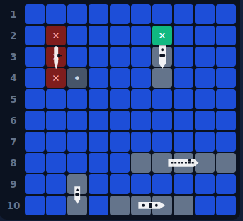

## Verification screenshots

**Placement — one stretched white icon per ship, horizontal and vertical:**

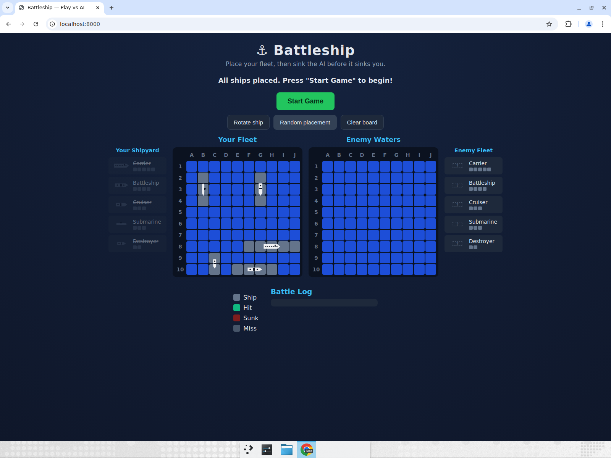

**Enemy fleet revealed on sink — each ship a single stretched icon over its red cells:**

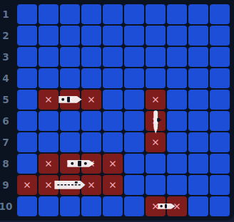

**Victory — full board with every enemy ship revealed as a stretched icon:**

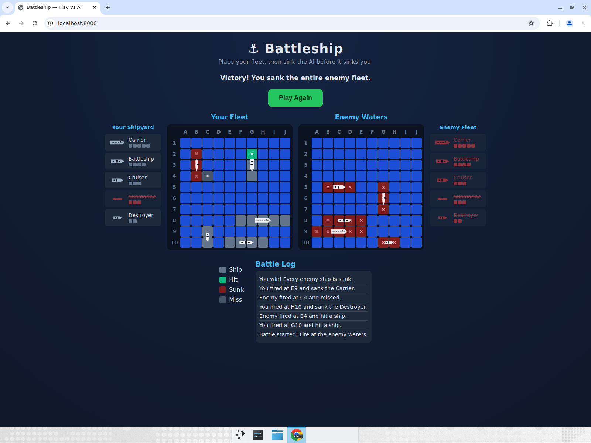

# Round 6 — Icon-only ships with status colours

This round removes the grey ship-cell background entirely and lets the stretched
icon **be** the ship. The icon now fills its full area (no surrounding grey), and
its **colour communicates the ship's status** instead of the cell background:

1. **Player board** — no grey cells. Each ship is a single full-size icon:
   **white** while intact, **green** once it has taken a hit (but is not sunk),
   and **red** when sunk. There are no longer any coloured cell backgrounds or
   ✕ marks on player ship cells; the icon colour alone shows state. (Misses on
   the player board still show the grey dot.)
2. **Enemy board** — unchanged until a ship is sunk: an un-sunk hit keeps the
   green ✕ and no icon. On sinking, the cell background is dropped and the ship
   is revealed as an **icon-only red silhouette** over the water.

## Implementation notes

- `js/ui.js` — `_gameCell()` no longer adds `ship`/`hit`/`sunk` background
  classes on the **player** board (only `miss`). On the **enemy** board it keeps
  `hit` (green ✕) for a hit-but-not-sunk cell and adds **no** class for a sunk
  cell, so the revealed icon sits on plain water.
- `js/ui.js` — `_renderShipOverlays()` adds a status modifier to each overlay:
  `ship-overlay-sunk` when `ship.hits >= ship.size`, else `ship-overlay-hit`
  when `ship.hits > 0`, else the default white.
- `styles.css` — the overlay SVG now fills the full box (`height: 100%`, was
  `70%`) so the icon is as large as its area; `.ship-overlay-hit { color: var(--hit) }`
  and `.ship-overlay-sunk { color: var(--danger) }` drive the status colours
  (the SVGs use `fill="currentColor"`).

## Testing methodology

A full browser playthrough was recorded (placement → battle → victory → Play
Again). Each behaviour was verified on screen:

- **No grey backgrounds / full-size icons** — at placement every ship was a
  large white icon directly on the water with no grey cell fill behind it.
- **Status colours** — a player Cruiser that took one hit turned its whole icon
  green while still afloat; a sunk Destroyer turned red; untouched ships stayed
  white.
- **Enemy reveal-on-sink** — a hit-but-not-sunk enemy cell kept the green ✕ with
  no icon; on sinking, the ship appeared as a red icon over plain water (no red
  cell background).
- **Victory** — every enemy ship was revealed as a red icon-only silhouette.
- **Play Again** — both boards cleared back to empty water and the placement
  phase.
- **Regression checks** — no console errors; turn-locking, repeat-shot
  rejection, HIT!/sunk messages, and win/loss detection all unchanged.

## Bugs found

**None.** All behaviour worked correctly on the first full playthrough and no
regressions were observed, so there are no before/after bug screenshots. The
images below are a before/after of the rendering change plus verification
evidence of each state.

## Before / after — rendering change

**Before (Round 5) — grey ship background behind a white icon, with ✕ overlays on hit/sunk cells:**


**After (Round 6) — no grey; the icon is the ship and its colour shows status (green = hit, red = sunk, white = intact):**

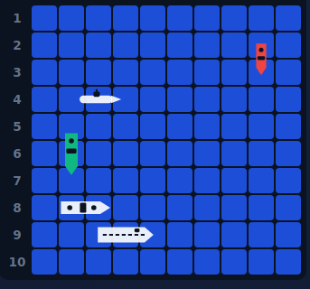

## Verification screenshots

**Placement — full-size white icons on water, no grey backgrounds:**

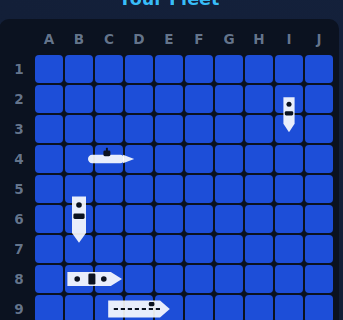

**Enemy ship revealed on sink — icon-only red silhouette, no cell background:**

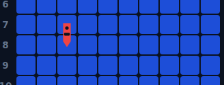

**Victory — every enemy ship shown as a red icon-only silhouette:**

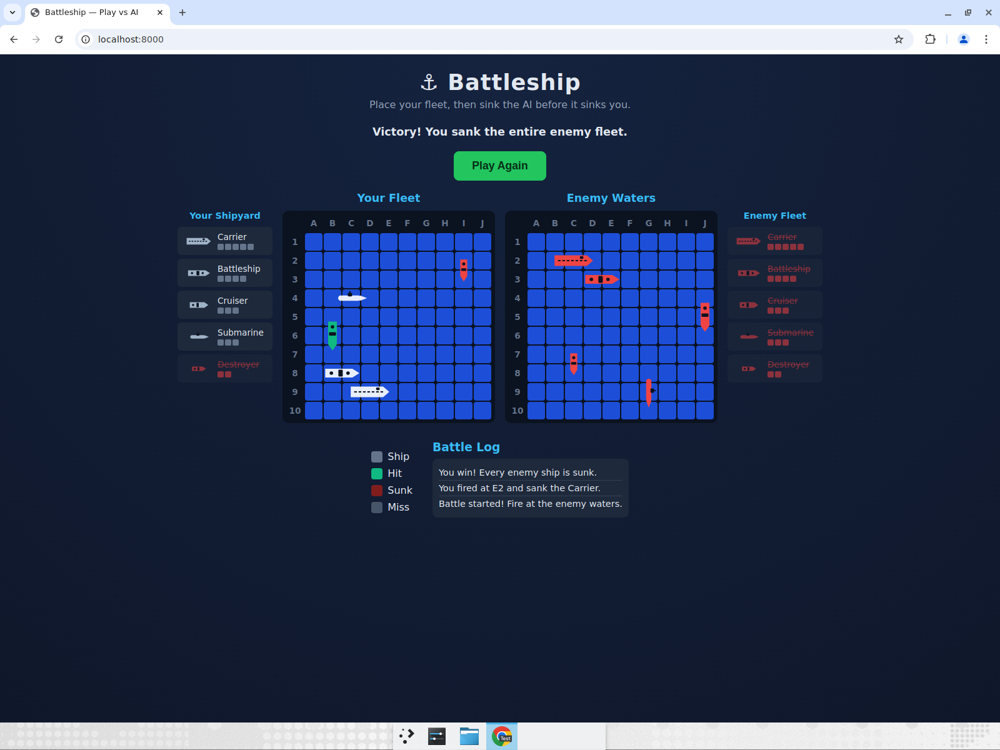

# Round 7 — Full-length icon stretch & per-cell hit colouring

Two refinements to the icon rendering:

1. **Full stretch** — icons now fill their footprint in **both** dimensions, so a
   vertically-placed Carrier is a full 5 cells high and a horizontal Battleship
   is a full 4 cells long, with no empty space in the first or last square.
2. **Per-cell hit colour** — when a ship is hit, only the **portion of the icon
   in the struck square** turns green. The rest of the ship stays white until it
   is fully sunk, at which point the **whole** icon turns the sunk colour (red).

## Implementation notes

- `js/ui.js` — `_renderShipOverlays()` now sets `preserveAspectRatio="none"` on
  each injected `<svg>`, so the icon scales to its container in both axes instead
  of preserving its natural proportions (which previously left gaps at the ends,
  especially on vertical ships).
- `js/ui.js` — per-cell colouring is done with stacked overlay layers instead of
  one solid-coloured overlay:
  - a **sunk** ship renders a single red overlay (the whole ship);
  - a **damaged** ship renders a white base overlay plus, for each hit cell, a
    green overlay clipped to that cell via
    `clip-path: inset(0 <right>px 0 <left>px)`, where
    `left = i * STEP` and `right = span - (i * STEP + CELL)` select exactly the
    i-th cell's slice of the full-length icon. (For vertical ships the overlay is
    built horizontally and rotated 90°, so the same horizontal clip maps to the
    correct vertical cell.)

## Testing methodology

Full recorded playthrough (placement → battle → victory → Play Again). Each
behaviour verified on screen:

- **Full stretch** — at battle start, vertical and horizontal ships filled their
  cells edge-to-edge with no empty end squares.
- **Per-cell green** — firing on individual cells of a horizontal Carrier and a
  vertical Cruiser turned only those exact squares green; the untouched cells of
  the same ships stayed white.
- **Whole-ship red on sink** — once every cell of the Carrier was hit, the entire
  icon switched to red, while a still-afloat Cruiser kept its single green cell.
- **Enemy reveal & victory** — enemy ships stayed hidden until sunk, then showed
  full-length red icons; victory revealed the whole enemy fleet.
- **Play Again** — both boards reset to empty water.
- **Regression checks** — no console errors; turn-locking, repeat-shot rejection,
  HIT!/sunk messages, and win/loss detection unchanged.

## Bugs found

**None.** Both refinements worked correctly on the first full playthrough with no
regressions, so there are no before/after bug screenshots — the images below are
verification evidence of each state.

## Verification screenshots

**Full stretch — vertical and horizontal icons fill every cell edge-to-edge:**

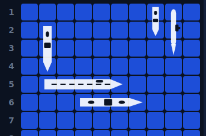

**Per-cell hit colour — only struck squares turn green (Carrier cells 1 & 4, Cruiser middle cell); rest stay white:**

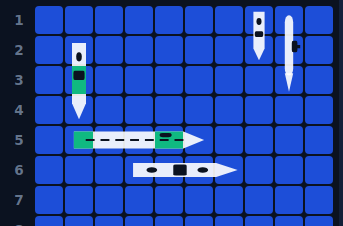

**Whole-ship red on sink — the fully-sunk Carrier is all red while the partially-hit Cruiser keeps one green cell:**

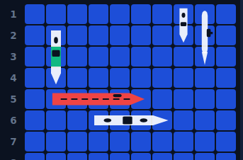

**Victory — full enemy fleet revealed as full-length red icons:**

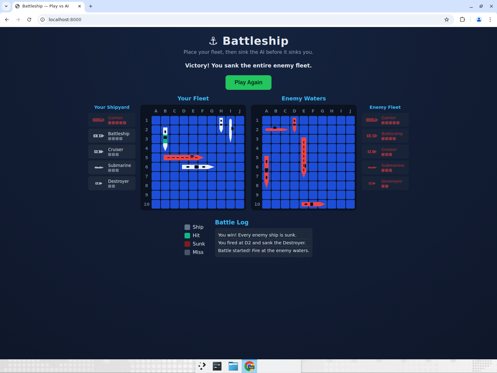

# Round 8 — Top-down submarine icon

The submarine icon was redrawn as a true top-down (bird's-eye) view to match the
other ship icons. All other logic and rendering behaviour is unchanged.

## What changed

- **Before:** the submarine SVG was effectively a side profile — a rounded hull
  with a conning tower box and a **periscope line sticking up above the hull**,
  which reads as a side view, not a top-down one.
- **After:** a top-down silhouette — a smooth cigar-shaped hull (rounded stern,
  tapered bow), a **sail / conning tower centred on the hull** (seen from above),
  symmetric **bow dive planes on both the port and starboard sides**, and a faint
  dashed deck centreline. The port/starboard symmetry is what makes it
  unambiguously top-down.

## Implementation notes

- `js/icons.js` — only the `submarine` SVG constant was replaced. It keeps the
  same `viewBox` (`0 0 38 20`), uses `currentColor` for the hull (so the existing
  white / green / red status colouring still applies) and the `DETAIL` colour for
  the sail and centreline. No other icon or any game/UI logic was touched.

## Testing methodology

Full recorded playthrough (placement → battle → victory → Play Again). Verified
on screen:

- **Shipyard** — the new top-down submarine icon shows in both the player and
  enemy shipyards.
- **Board (stretched)** — the icon stretches correctly across all 3 of the
  submarine's cells in both orientations, with no empty end squares.
- **Per-cell hit colour** — hitting the middle cell turned only that cell green;
  bow and stern stayed white (Round 7 behaviour preserved with the new icon).
- **Sunk** — once fully hit, the whole submarine icon turned red.
- **Enemy reveal-on-sink** — the enemy submarine stayed hidden until sunk, then
  revealed the new icon in red (icon-only, no background).
- **Victory & Play Again** — full enemy fleet revealed (including the new sub
  icon); Play Again reset both boards. No console errors.

## Bugs found

**None.** The icon swap rendered correctly on the first playthrough and all
existing behaviours were preserved. The images below are verification evidence.

## Verification screenshots

**New top-down submarine on the board (cigar hull, centred sail, symmetric dive planes):**


**Per-cell hit — only the struck (middle) cell is green; bow and stern stay white:**


**Sunk — the whole submarine turns red:**


**Victory — enemy fleet revealed, including the new submarine icon (vertical, red):**

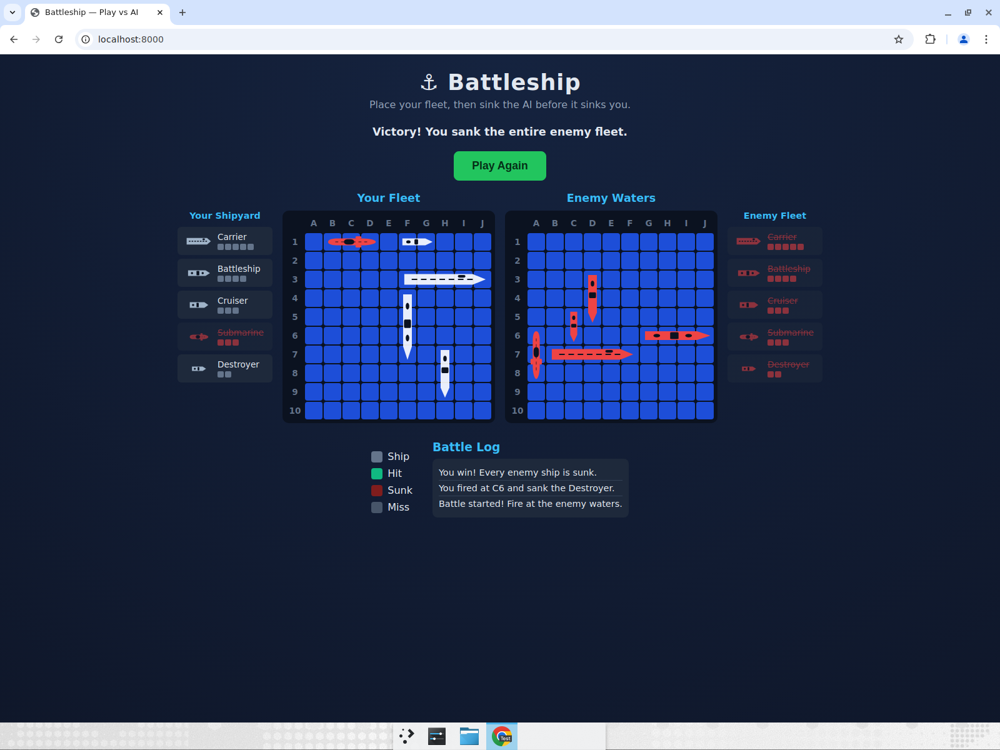

# Round 9 — Overlay message wording

Three flash-overlay messages were reworded. No other logic changed.

## What changed

| Event | Before | After |
| --- | --- | --- |
| You sink an enemy ship | `You sunk their [Ship]!` | `You have sunk an Enemy [Ship]` |
| Enemy sinks your ship | `They sunk your [Ship]!` | `The Enemy has sunk your [Ship]` |
| Enemy hits your ship | `HIT!` | `You've been Hit!` |

The `[Ship]` placeholder is filled with the actual sunk ship's name. The
**player-hit** overlay (when *you* hit an enemy ship) is intentionally unchanged
and still reads `HIT!`.

## Implementation notes

- `js/ui.js` — `_flashForOutcome(outcome, who)` is the single place that builds
  these strings. `who === 'player'` means the player fired; `who === 'ai'` means
  the AI fired. The sunk branch now picks
  `You have sunk an Enemy ${name}` / `The Enemy has sunk your ${name}` by `who`,
  and the hit branch picks `HIT!` (player) / `You've been Hit!` (ai). The sunk
  ship icon and the missile graphic are unchanged.

## Testing methodology

Placement → battle, then each overlay was exercised through the real
`_flashForOutcome` code path (the same function the live click / AI-turn handlers
call) and captured on screen. Normal turn-by-turn play was also run afterwards to
confirm no regressions and no console errors.

- **You sink an enemy ship** — overlay read `You have sunk an Enemy Cruiser` with
  the cruiser icon (also confirmed via the real player-fire flow: log line
  "You fired at G4 and sank the Cruiser").
- **Enemy sinks your ship** — overlay read `The Enemy has sunk your Battleship`
  with the battleship icon.
- **Enemy hits your ship** — overlay read `You've been Hit!` with the missile
  graphic.
- **You hit an enemy ship** — overlay still read `HIT!` (unchanged).
- **Regression** — turns alternated normally, log updated correctly, no console
  errors.

## Bugs found

**None.** All four overlay states rendered the correct text on the first
playthrough. The images below are verification evidence.

## Verification screenshots

**You sink an enemy ship — "You have sunk an Enemy Cruiser":**

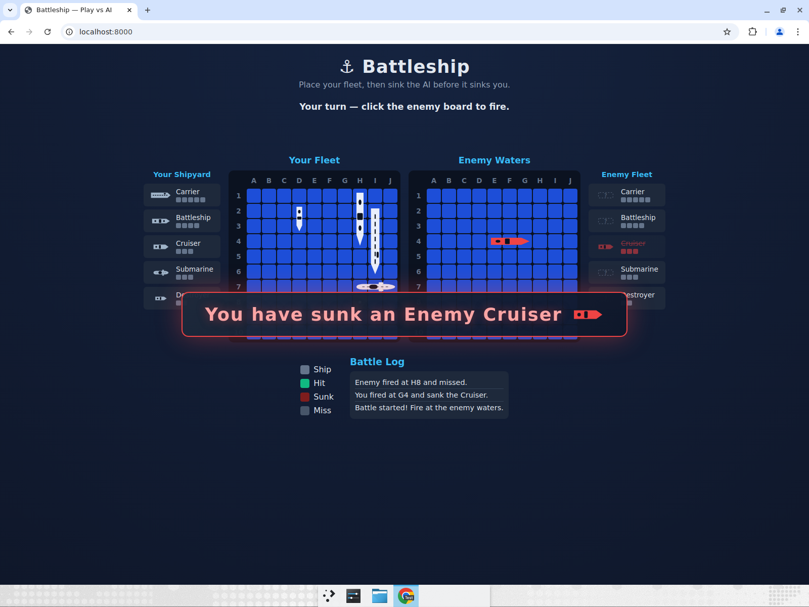

**Enemy sinks your ship — "The Enemy has sunk your Battleship":**

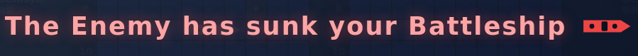

**Enemy hits your ship — "You've been Hit!":**

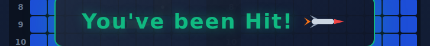

**You hit an enemy ship — still "HIT!" (unchanged):**


# Round 10 — Turn-status bug fix + AI "thinking" delay

## Bug found (reported by Kris V)

**The top status text always read `Your turn — click the enemy board to fire.`
even while it was the enemy's (AI's) turn to fire.** Reported by Kris V during
play.

| | Status text shown |
| --- | --- |
| Player's turn | `Your turn — click the enemy board to fire.` ✅ |
| Enemy's turn (before fix) | `Your turn — click the enemy board to fire.` ❌ |
| Enemy's turn (after fix) | `Enemy's turn — incoming fire!` ✅ |

### Cause

`_renderStatus()` in `js/ui.js` set a single hard-coded string for the entire
`PHASE.PLAYING` phase:

```js
} else if (phase === PHASE.PLAYING) {
  msg = 'Your turn — click the enemy board to fire.';
}
```

It never consulted whose turn it was. The UI already tracks this with the
`this.busy` flag (set to `true` while the AI is taking its turn and back to
`false` when control returns to the player), but `_renderStatus()` ignored it.

### Fix

Branch on `this.busy` so the status reflects whose turn it is:

```js
} else if (phase === PHASE.PLAYING) {
  msg = this.busy
    ? "Enemy's turn — incoming fire!"
    : 'Your turn — click the enemy board to fire.';
}
```

No other state was needed — `busy` is already toggled in `_handlePlayerShot`
(true before the AI fires) and `_runAiTurn` (false after), and `render()` runs at
both points, so the status updates automatically on each turn change.

## Related change — AI "thinking" delay

To make the game flow better (and make the enemy-turn state easy to see), the
pause between the player's shot and the AI's response was increased in
`_handlePlayerShot`:

```diff
- setTimeout(() => this._runAiTurn(), flashed ? 1300 : 600);
+ setTimeout(() => this._runAiTurn(), flashed ? 2000 : 1400);
```

So the AI now waits ~1.4s after a miss / ~2s after a hit (the longer delay still
lets the player's hit flash finish first), which reads as the AI "thinking".

## Testing methodology

Placement → battle. The bug was reproduced before the fix, then the fix and the
new delay were verified both by forcing the `busy` state and by normal
turn-by-turn play (a real click on Enemy Waters, then waiting for the AI to
respond). Console was clean throughout.

- **Before fix** — with the AI taking its turn (`busy = true`), the status still
  read `Your turn — click the enemy board to fire.` (bug).
- **After fix, your turn** — at battle start the status read
  `Your turn — click the enemy board to fire.`
- **After fix, enemy turn** — after firing, the status read
  `Enemy's turn — incoming fire!` while the AI was "thinking"; the battle log
  showed only the player's shot at that moment, confirming the AI had not yet
  fired.
- **Revert** — once the AI fired, the status returned to
  `Your turn — click the enemy board to fire.`
- **Regression** — turns alternated normally with the longer delay, log updated
  correctly, no console errors.

## Verification screenshots

**Before fix — status still reads "Your turn" during the enemy's turn (bug):**

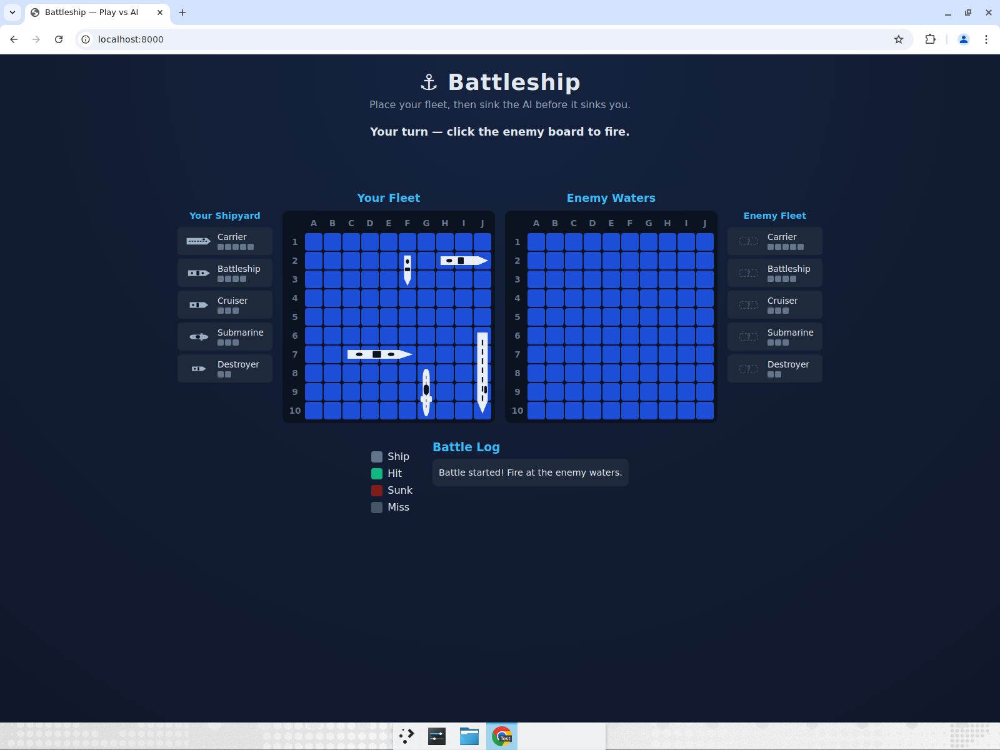

**After fix — player's turn reads "Your turn":**

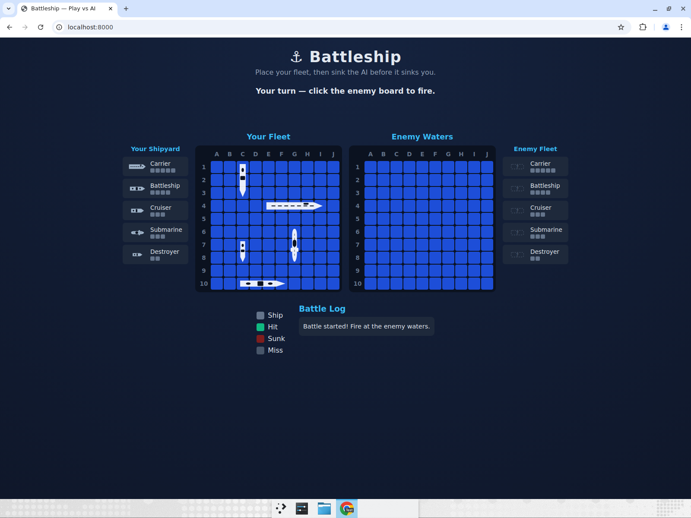

**After fix — enemy's turn reads "Enemy's turn — incoming fire!":**

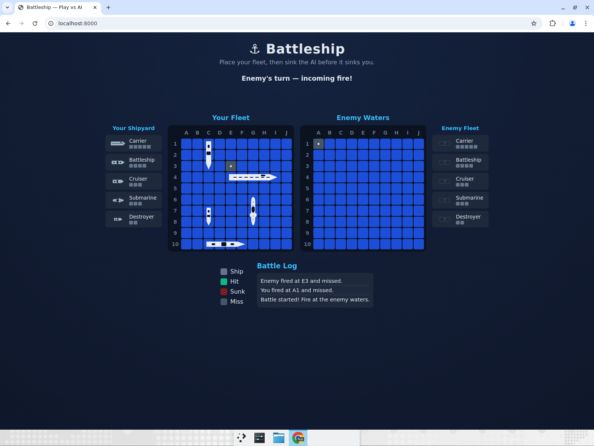

# Round 11 — Reveal surviving enemy ships on a loss + faster AI delay

## What changed

1. **Reveal the enemy's surviving ships when the player loses.** When the AI
   wins, the enemy board now reveals every ship that was not sunk. Fully intact
   ships are shown in white; partially-hit ships reveal only their remaining
   (un-hit) cells in white, while the cells that were already hit keep their hit
   colour (green). (On a win this is a no-op — every enemy ship is already sunk.)
2. **Reduced the AI "thinking" delay** to roughly halfway between the original
   and the Round 10 values — ~1.0s after a miss / ~1.65s after a hit.

## Implementation notes

- `js/ui.js` — `_renderShipOverlays(container, board, revealShips, isEnemy)`
  previously only drew an enemy ship's icon once it was sunk
  (`show = ship.hits >= ship.size`). It now also shows surviving enemy ships when
  the game is over and the AI won:

  ```js
  const revealOnLoss =
    isEnemy && this.game.phase === PHASE.OVER && this.game.winner === 'ai';
  const show = isEnemy
    ? ship.hits >= ship.size || revealOnLoss
    : revealShips;
  ```

  The existing non-sunk render path already draws a **white base layer** for the
  whole ship plus a **green clip-path layer per hit cell**, so partially-hit
  survivors automatically show white where un-hit and green where hit. Sunk ships
  still render as a full red icon.

- `js/ui.js` — `_handlePlayerShot` AI delay:

  ```diff
  - setTimeout(() => this._runAiTurn(), flashed ? 2000 : 1400);
  + setTimeout(() => this._runAiTurn(), flashed ? 1650 : 1000);
  ```

## Testing methodology

Placement → battle. A loss was forced through the real board/attack functions
(partially hitting the enemy carrier, fully sinking the enemy destroyer, then
sinking the player's fleet so `winner === 'ai'`), then the reveal was inspected
on the enemy board. Normal play, Play Again, and the new AI delay were also
verified. Console was clean throughout.

- **Loss reveal** — intact enemy ships (battleship, cruiser, submarine) rendered
  in **white**; the **partially-hit carrier** showed its two hit cells **green**
  with the remaining three cells **white**; the **sunk destroyer** rendered full
  **red**.
- **Play Again** — boards cleared and enemy ships hidden again; back to the
  "Place Ships" start state.
- **AI delay** — after a real shot the status showed `Enemy's turn — incoming
  fire!` during the shorter (~1.0s / 1.65s) pause, then reverted to the player's
  turn.
- **Regression** — turns alternated normally, log updated correctly, no console
  errors.

## Bugs found

**None.** The reveal and the delay change both worked on the first playthrough.
The images below are verification evidence.

## Verification screenshots

**Player loss — enemy's surviving ships revealed (intact = white, partial carrier
= green hits + white remainder, sunk destroyer = red):**

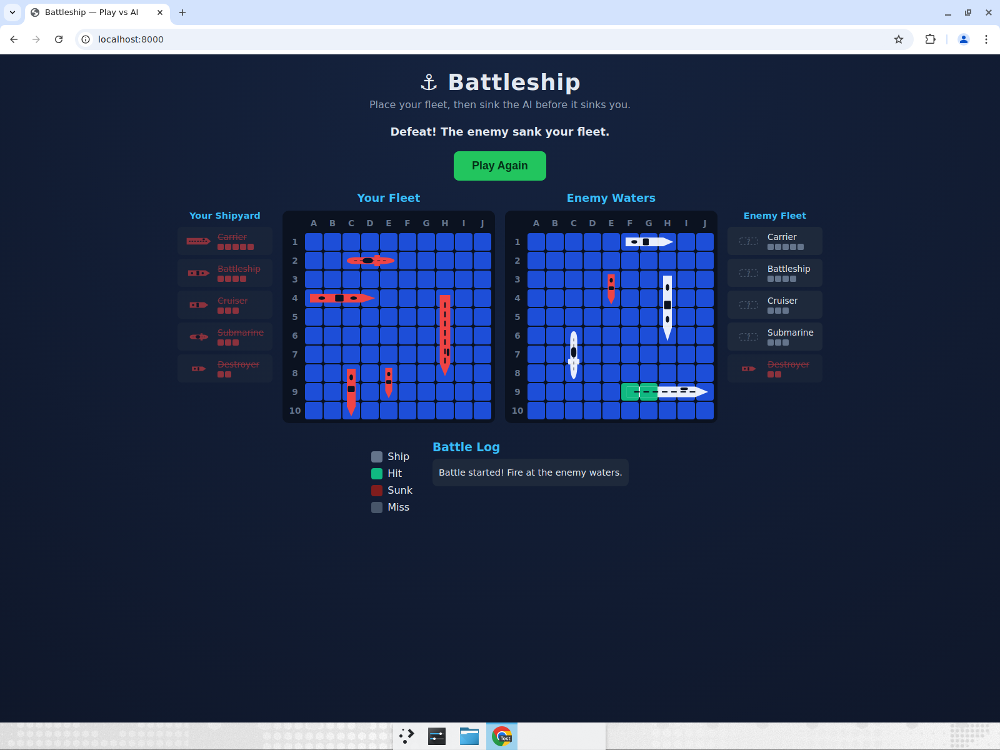

**Close-up of Enemy Waters after the loss:**

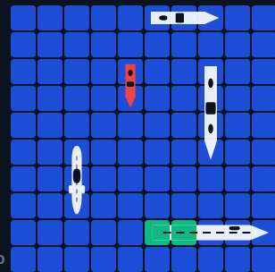
